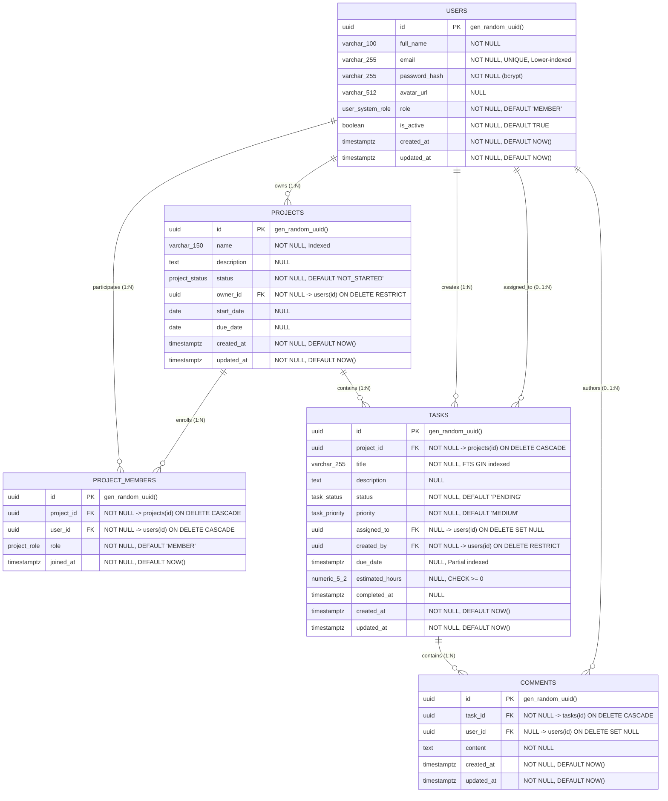

# Entity Relationship (ER) Diagram

This document contains the official Entity Relationship Diagram for the Project Management System, modeling the actual PostgreSQL schema implemented in [`database/schema.sql`](file:///Users/harsh/Desktop/Project_management/database/schema.sql).

---

## Mermaid ER Diagram

---

## Entity & Relationship Catalog

| Relationship | Type | Cardinality | Foreign Key | Delete Action | Architectural Purpose |
| :--- | :--- | :--- | :--- | :--- | :--- |
| **`users` ➔ `projects`** | One-to-Many | `1 : 0..*` | `projects.owner_id ➔ users.id` | `RESTRICT` | Explicit project ownership. Protects active projects from accidental creator deletion. |
| **`projects` ↔ `users`** | Many-to-Many | `* : *` | Junction via `project_members(project_id, user_id)` | `CASCADE` | Allows multi-user team collaboration with scoped permissions (`OWNER`, `ADMIN`, `MEMBER`, `VIEWER`). |
| **`projects` ➔ `tasks`** | One-to-Many | `1 : 0..*` | `tasks.project_id ➔ projects.id` | `CASCADE` | Projects group tasks. Deleting a project purges its tasks. |
| **`users` ➔ `tasks` (creator)** | One-to-Many | `1 : 0..*` | `tasks.created_by ➔ users.id` | `RESTRICT` | Preserves audit history of task creators. |
| **`users` ➔ `tasks` (assignee)** | One-to-Many | `0..1 : 0..*` | `tasks.assigned_to ➔ users.id` | `SET NULL` | Tasks can be unassigned; if an assignee leaves, the task remains intact. |
| **`tasks` ➔ `comments`** | One-to-Many | `1 : 0..*` | `comments.task_id ➔ tasks.id` | `CASCADE` | Comments belong to a task thread. Deleting a task cleans up discussion records. |
| **`users` ➔ `comments` (author)** | One-to-Many | `0..1 : 0..*` | `comments.user_id ➔ users.id` | `SET NULL` | Discussion threads remain readable even if a user account is deleted. |

---

## Legend

- **`PK`**: Primary Key (UUID v4 generated via `gen_random_uuid()`)
- **`FK`**: Foreign Key referencing parent table
- **`UNIQUE`**: Unique database constraint
- **`NOT NULL`**: Required field enforced by database schema
- **`Indexed`**: Backed by B-Tree, Partial, or GIN performance index
